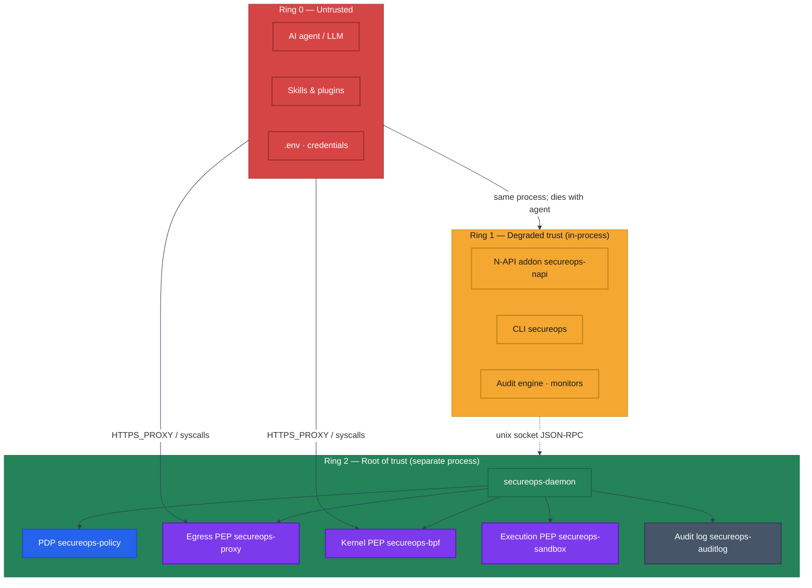
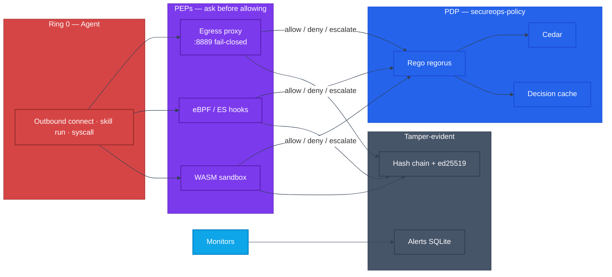
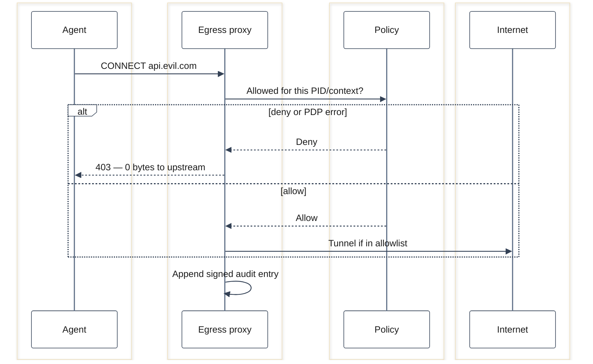

<div align="center">

# SecureOps

**Out-of-band security for AI agents — audit, harden, and enforce from outside the agent process.**

[](https://github.com/aryasoni98/secureops/actions/workflows/ci.yml)
[](https://crates.io/crates/secureops-cli)
[](LICENSE)
[](https://www.rust-lang.org)
[](#install)

[Install](#install) · [Quick start](#quick-start) · [How it works](#how-it-works) · [CLI](#cli-reference) · [Configuration](#configuration) · [Contributing](#contributing)

</div>

---

AI agents read secrets, call tools, and reach the network. When an agent is compromised, **in-process guardrails can be switched off by the attacker.** SecureOps moves the enforcement boundary **outside the agent process** — into a privileged daemon that keeps working even after the agent is owned.

- 🔍 **Audit** — OWASP-ASI–mapped checks, a 0–100 score, and a CI gate (`exit 2` below threshold).
- 🛠️ **Harden** — auto-fixable remediations with timestamped backups and rollback.
- 🛡️ **Enforce** — a fail-closed egress proxy (HTTPS allowlist, `403` + 0 bytes on deny), runtime monitors, and an emergency kill switch.
- 🧾 **Prove** — tamper-evident, hash-chained, ed25519-signed audit log.

> [!NOTE]
> **Beta (`v0.0.1`).** Audit + harden + **egress enforcement** + monitors + kill switch + signed audit log are live and tested against real endpoints. Kernel (eBPF), execution-sandbox seccomp, and TPM-backed signing are **feature-gated** (`--features ebpf,seccomp,tpm`) and still being finalized — see [Project status](#project-status).

---

## Install

### CLI (prebuilt binary)

Download a release archive for your platform from **[Releases](https://github.com/aryasoni98/secureops/releases)** and put `secureops` on your `PATH`:

```sh
# linux-x86_64 · linux-arm64 · macos-x86_64 · macos-arm64
curl -L https://github.com/aryasoni98/secureops/releases/latest/download/secureops-v0.0.1-linux-x86_64.tar.gz | tar xz
sudo mv secureops-cli /usr/local/bin/secureops
secureops --help
```

### CLI (from crates.io)

```sh
cargo install secureops-cli      # installs the `secureops` binary
cargo install secureops-daemon   # Ring-2 enforcement daemon (optional)
```

### From source

```sh
git clone https://github.com/aryasoni98/secureops.git
cd secureops
cargo build --release -p secureops-cli -p secureops-daemon
```

### As a library

The workspace is published as 16 focused crates (e.g. `secureops-core`, `secureops-checks`, `secureops-proxy`, `secureops-policy`). Depend on what you need:

```toml
[dependencies]
secureops-core = "0.0.1"
```

### Container / Kubernetes

Docker image + Kustomize manifests live in [`deploy/`](deploy). Step-by-step **[AWS EC2 + Kubernetes deployment guide → docs/DEPLOY_AWS_K8S.md](docs/DEPLOY_AWS_K8S.md)**; local/dev runbook in [docs/RUNNING.md](docs/RUNNING.md).

---

## Quick start

```sh
export OPENCLAW_STATE_DIR=~/.openclaw     # where state + keystore live

secureops init        # scaffold .secureops/ + Argon2id keystore
secureops audit        # score your config (human report)
secureops audit --json # CI gate: exits 2 if score < 80
secureops harden       # apply safe auto-fixes (backup + rollback)
secureops status       # score, kill-switch, monitor toggles
```

Turn on **egress enforcement** — agent traffic must go through an allowlist or it is dropped:

```sh
# 1. allow only these hosts in $OPENCLAW_STATE_DIR/openclaw.json (see Configuration)
# 2. start the daemon (binds 127.0.0.1:8889, fail-closed)
secureops-daemon
# 3. point the agent at the proxy
export HTTPS_PROXY=http://127.0.0.1:8889
```

Allowed host → tunnels through. Anything else → `403 Forbidden`, **zero bytes** reach the upstream.

Contributors can use the one-command bootstrap (needs [`just`](https://github.com/casey/just)):

```sh
just setup     # check deps → build → test → init demo state
just --list    # all recipes (audit, harden, daemon, docker-*, k8s-*)
```

---

## Features

| | |
|---|---|
| **Security audit** | OWASP-ASI–mapped checks across 9 categories, 0–100 score, cross-layer correlation, JSON output for CI gating |
| **Hardening** | Gateway / credentials / config / Docker / network remediations, timestamped backups, `--rollback` |
| **Egress enforcement** | HTTPS `CONNECT` allowlist proxy + DNS sinkhole, **fail-closed** (`403`, 0 bytes out), signed audit trail per decision |
| **Runtime monitors** | Cost / spend circuit-breaker, credential-access patterns, memory-file tampering, skill IOC + typosquat scan |
| **Policy engine (PDP)** | Rego (regorus) + Cedar + dependency-free allowlist, decision cache, hot-reload |
| **Kill switch** | One command halts enforcement + blocks tool calls; daemon refuses to start while active |
| **Tamper-evident log** | SHA-256 hash chain + ed25519 signing (OS keychain; TPM optional) |
| **TS wire-compatible** | JSON is byte-compatible with the original `@adversa/secureops` TypeScript tool |

---

## How it works

The agent (**Ring 0**) is assumed hostile. Audit/monitor logic (**Ring 1**) runs in-process and can be bypassed once the agent is owned. The **Ring 2** daemon runs as a separate privileged process and remains the root of trust — its egress proxy, policy decisions, and audit log survive a compromised agent.



| Ring | Runs where | Trust | If the agent is owned |
|------|------------|-------|-----------------------|
| **0** | Agent process | None | Attacker controls everything here |
| **1** | Agent process (N-API) or operator CLI | Low | Audit/monitor can be bypassed |
| **2** | `secureops-daemon` (privileged, separate) | High | Egress proxy, PDP, and log still apply |

### Enforcement spine — one PDP, many PEPs

A single **Policy Decision Point** answers allow / deny / escalate; dumb **Policy Enforcement Points** ask before letting anything through.



### Egress decision (the headline path)



> Deep architecture (full diagrams, deployment topology, all six workflows): **[PRODUCT.md](PRODUCT.md)** and **[docs/RUNNING.md](docs/RUNNING.md)**.

---

## CLI reference

```
secureops <COMMAND>
```

| Command | What it does |
|---------|--------------|
| `init` | Scaffold `.secureops/` state dir + Argon2id keystore |
| `audit` | Run the audit; print a colored report (or `--json` for CI, `--deep` for port probes) |
| `harden` | Apply auto-fixable remediations (`--full` for all, `--rollback <id>` to revert) |
| `status` | Show score, kill-switch state, monitor toggles |
| `monitor` | Start runtime monitors (Ctrl-C to stop) |
| `behavioral` | Rolling tool-call baseline stats (`--window 60`) |
| `kill` | Emergency stop (`--deactivate` to resume) |
| `export-incident` | Bundle audit + findings into a portable incident report |

`secureops-daemon` runs the Ring-2 enforcement loop (monitors + egress proxy + audit log).

---

## Configuration

State lives under `$OPENCLAW_STATE_DIR` (default `~/.openclaw`). Egress enforcement reads `openclaw.json`:

```json
{
  "secureops": {
    "network": {
      "egressAllowlistEnabled": true,
      "egressAllowlist": ["api.anthropic.com", "api.openai.com"]
    }
  }
}
```

| Variable | Default | Used by |
|----------|---------|---------|
| `OPENCLAW_STATE_DIR` | `~/.openclaw` | CLI, daemon, containers |
| `HTTPS_PROXY` | — | the agent, pointed at `http://127.0.0.1:8889` |
| `SECUREOPS_BPF_OBJ` | unset | daemon — path to compiled eBPF object (Linux, `ebpf` feature) |

---

## Crates

16 published crates, layered so everything depends inward on `secureops-core`.

| Crate | Ring | Responsibility |
|-------|------|----------------|
| [`secureops-core`](https://crates.io/crates/secureops-core) | 0 | Types, traits, scoring — no I/O |
| [`secureops-checks`](https://crates.io/crates/secureops-checks) | 1 | Audit findings across 9 OWASP-ASI categories |
| [`secureops-fs`](https://crates.io/crates/secureops-fs) | 1 | `tokio::fs` context, kill switch, behavioral baseline |
| [`secureops-intel`](https://crates.io/crates/secureops-intel) | 1 | IOC matching, typosquat, tree-sitter scan, signed feed |
| [`secureops-crypto`](https://crates.io/crates/secureops-crypto) | 1 | Argon2id keystore, AES-GCM, keychain / TPM signing |
| [`secureops-harden`](https://crates.io/crates/secureops-harden) | 1 | Harden + rollback (5 modules) |
| [`secureops-monitors`](https://crates.io/crates/secureops-monitors) | 1 | 4 monitors, AlertBus, SQLite |
| [`secureops-cli`](https://crates.io/crates/secureops-cli) | 1 | The `secureops` binary |
| [`secureops-napi`](https://crates.io/crates/secureops-napi) | 1 | Node native addon |
| [`secureops-policy`](https://crates.io/crates/secureops-policy) | 2 | PDP: Rego, Cedar, decision cache |
| [`secureops-proxy`](https://crates.io/crates/secureops-proxy) | 2 | Egress PEP + DNS sinkhole |
| [`secureops-bpf`](https://crates.io/crates/secureops-bpf) | 2 | Kernel PEP (Linux eBPF; `ebpf` feature) |
| [`secureops-sandbox`](https://crates.io/crates/secureops-sandbox) | 2 | wasmtime execution PEP (host seccomp behind `seccomp`) |
| [`secureops-auditlog`](https://crates.io/crates/secureops-auditlog) | 2 | Hash chain + ed25519 |
| [`secureops-ipc`](https://crates.io/crates/secureops-ipc) | 2 | Unix JSON-RPC + peer-cred auth |
| [`secureops-daemon`](https://crates.io/crates/secureops-daemon) | 2 | Ring-2 supervisor |

---

## Project status

`v0.0.1` is a beta. The default build is cross-platform (Linux + macOS) and needs no system libraries.

| Capability | State |
|------------|-------|
| Audit · harden · score · CI gate | ✅ live |
| Egress proxy enforcement (allowlist, fail-closed) | ✅ live, tested against real endpoints |
| Runtime monitors · kill switch · signed audit log | ✅ live |
| Policy engine (Rego / Cedar / allowlist) | ✅ live |
| Kernel PEP (eBPF) | 🚧 behind `--features ebpf` (Linux), being finalized |
| Execution-host seccomp | 🚧 behind `--features seccomp` (Linux) |
| TPM-backed signing | 🚧 behind `--features tpm` (Linux + `libtss2-dev`) |

Default signing uses the OS keychain (ed25519). Optional features pull extra system dependencies and are off by default.

---

## Development

```sh
cargo build --workspace
cargo test --workspace      # ~165 tests
just ci                     # fmt-check + clippy -D warnings + test (matches CI)
```

Optional Linux enforcement features:

```sh
cargo build -p secureops-bpf --features ebpf        # needs aya toolchain
cargo build -p secureops-sandbox --features seccomp
cargo build -p secureops-crypto --features tpm      # needs libtss2-dev
```

The Node addon (`secureops-napi`) and the JSON wire format stay byte-compatible with the original TypeScript tool. eBPF kernel programs live in [`ebpf/`](ebpf) and build separately (Linux only) — see [docs/RUNNING.md](docs/RUNNING.md).

---

## Contributing

Contributions are welcome — issues, bug reports, and PRs.

1. Fork and branch from `master`.
2. Keep the gate green: `just ci` (or `cargo fmt --all --check && cargo clippy --workspace -- -D warnings && cargo test --workspace`).
3. Add tests for new behavior; keep the JSON wire format stable.
4. Use clear, conventional commit messages; open a PR describing the change and its rationale.

New to the codebase? Start with [PRODUCT.md](PRODUCT.md) for the architecture, then `crates/secureops-core` for the type/scoring contract.

---

## Security

SecureOps is a security tool; please report vulnerabilities **privately** rather than in public issues. Open a [GitHub security advisory](https://github.com/aryasoni98/secureops/security/advisories/new) or email the maintainer. The audit log is hash-chained and ed25519-signed so tampering is detectable; signing keys are held in the OS keychain (or TPM with `--features tpm`), never in a passphrase keystore.

---

## License

[MIT](LICENSE) © Adversa AI

<sub>Rust port of the <a href="https://www.npmjs.com/package/@adversa/secureops"><code>@adversa/secureops</code></a> TypeScript tool (v2.2.0 reference).</sub>
