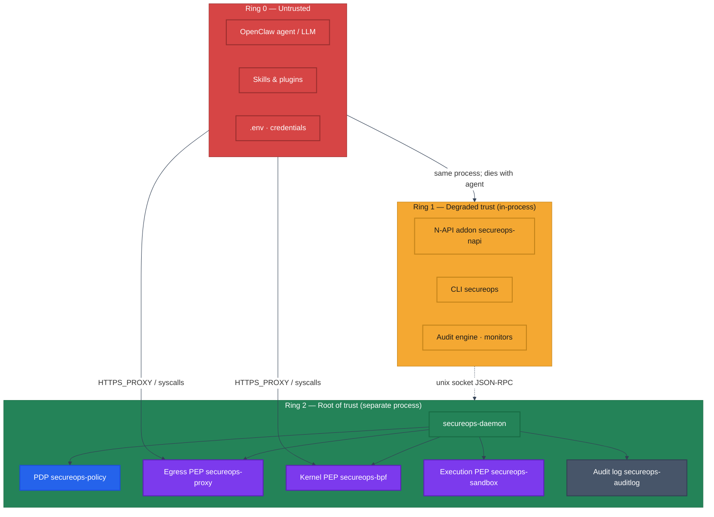
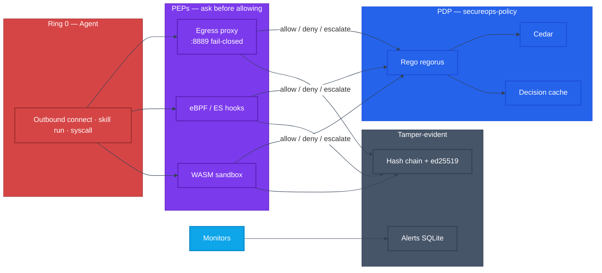
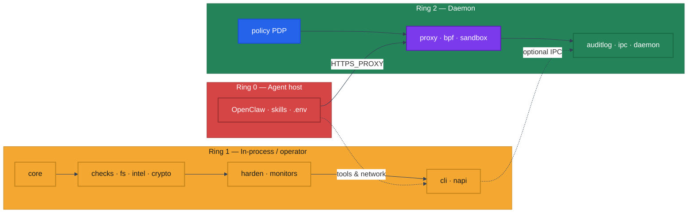
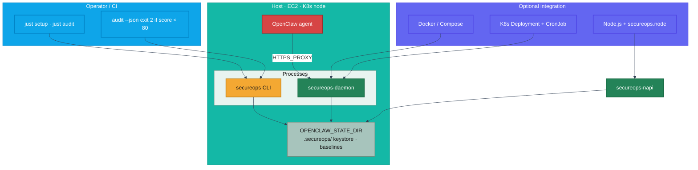
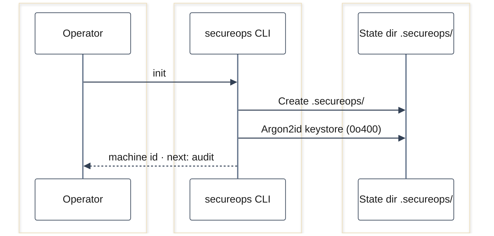
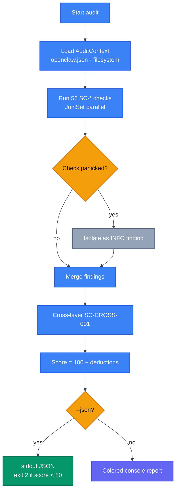
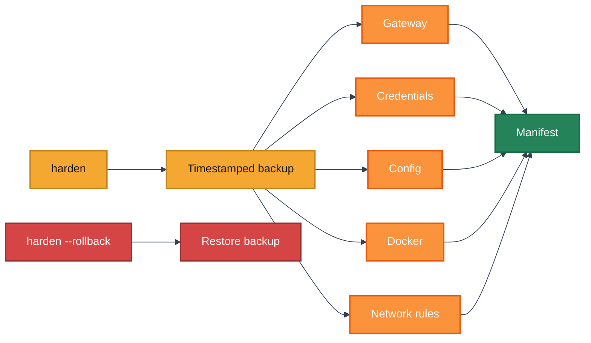
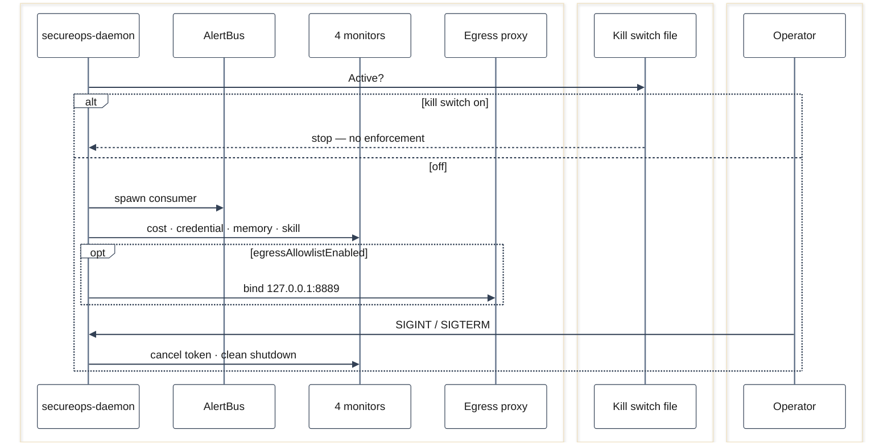
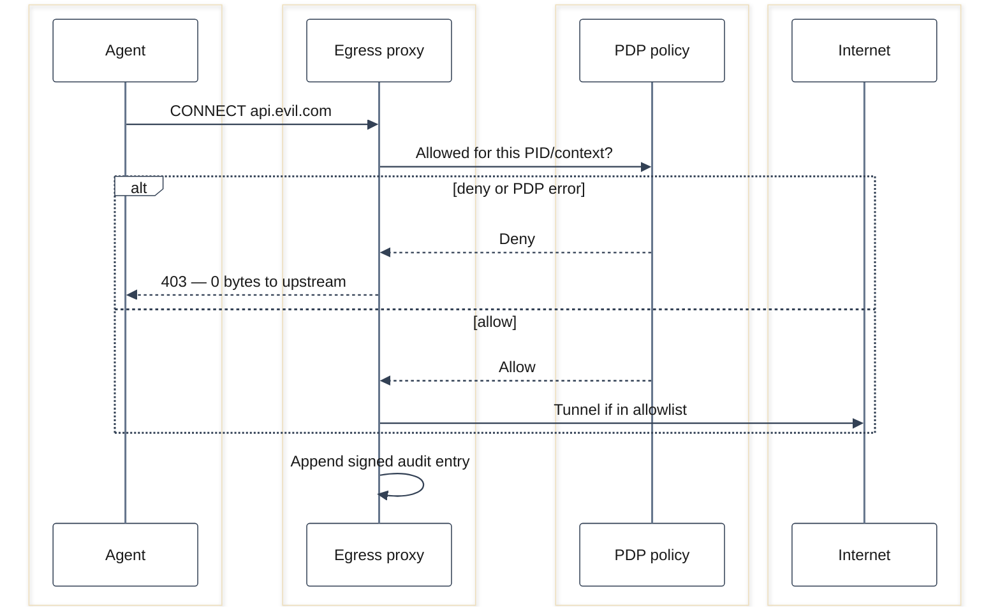
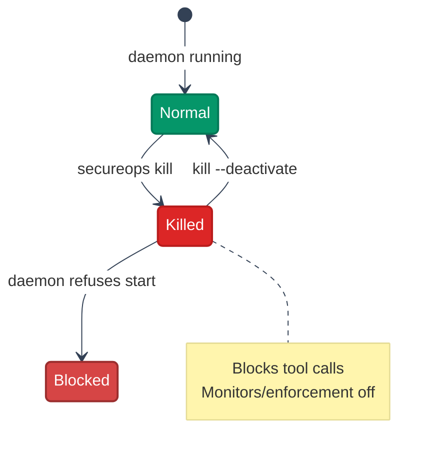

# SecureOps — Rust workspace

Rust port of [`@adversa/secureops`](https://www.npmjs.com/package/@adversa/secureops) (v2.2.0): security audit, hardening, and **out-of-band enforcement** for OpenClaw agent deployments.

| | |
|---|---|
| **Tests** | ~165 workspace tests |
| **Architecture** | Three trust rings + PDP/PEP ([PRODUCT.md](PRODUCT.md)) |
| **Run locally / Docker / K8s** | **[docs/RUNNING.md](docs/RUNNING.md)** |
| **One-command setup** | `just setup` (see [Justfile](Justfile)) |

---

## What problem this solves

AI agents can read secrets, call tools, and reach the network. If the agent is compromised, **in-process guards can be disabled by the attacker**.

SecureOps moves the enforcement boundary **outside the agent process**:

- **Observe** — 56 OWASP ASI–mapped checks, scoring, hardening, live monitors  
- **Enforce** — egress proxy, policy engine, sandbox, kernel hooks (Ring 2 daemon)

The agent (Ring 0) is assumed hostile; the daemon (Ring 2) keeps working after compromise.

---

## Architecture at a glance

| Fill | Role |
|------|------|
| `#D64545` | Ring 0 — untrusted agent |
| `#F4A832` | Ring 1 — in-process / CLI |
| `#248358` | Ring 2 — daemon / root of trust |
| `#7C3AED` | PEP — enforcement points |
| `#2563EB` | PDP — policy engine |
| `#475569` | Audit log / persistence |
| `#0EA5E9` | Operator / CI |

### Three trust rings (2D view)

Trust increases **outward**. Enforcement strength increases **downward** (Ring 2).



| Ring | Runs where | Trust | If agent is owned |
|------|------------|-------|-------------------|
| **0** | Agent process | None | Attacker controls everything here |
| **1** | Agent process (N-API) or operator CLI | Low | Audit/monitor can be bypassed |
| **2** | `secureops-daemon` (privileged, separate) | High | Egress proxy, PDP, log still apply |

---

### PDP / PEP split (enforcement spine)

One brain (**Policy Decision Point**), many dumb enforcers (**Policy Enforcement Points**).



| Component | Crate | Role |
|-----------|-------|------|
| **PDP** | `secureops-policy` | Single authority: allow, deny, escalate |
| **Egress PEP** | `secureops-proxy` | HTTP CONNECT + DNS sinkhole; unknown host → 403, 0 bytes out |
| **Kernel PEP** | `secureops-bpf` | `openat` / `connect` / `execve` correlation (Linux eBPF) |
| **Execution PEP** | `secureops-sandbox` | wasmtime + WASI; fuel/epoch limits |
| **IPC** | `secureops-ipc` | Unix socket, `SO_PEERCRED` — do not trust agent tokens |
| **Daemon** | `secureops-daemon` | Wires PDP + PEPs + monitors + shutdown |

---

### Component map (crates × rings)

Two dimensions: **ring** (trust) × **layer** (core → checks → enforcement).



| Layer | Crates |
|-------|--------|
| **Core** | `secureops-core` (types, scoring — no I/O) |
| **Audit** | `secureops-checks`, `secureops-fs`, `secureops-intel`, `secureops-crypto` |
| **Operate** | `secureops-harden`, `secureops-monitors`, `secureops-cli`, `secureops-napi` |
| **Enforce** | `secureops-policy`, `secureops-proxy`, `secureops-bpf`, `secureops-sandbox` |
| **Supervise** | `secureops-auditlog`, `secureops-ipc`, `secureops-daemon` |

**Dependency rule:** everything depends inward on `secureops-core`.

---

### Deployment topology (where binaries run)



Details: [docs/RUNNING.md](docs/RUNNING.md) (local, EC2, Kubernetes).

---

## Workflows

### 1. Bootstrap (`secureops init`)



```sh
just setup    # build + test + init (default /tmp/secureops-demo)
# or: just state-init
```

---

### 2. Audit (read-only, CI gate)



```sh
just audit              # human report
just audit-json         # CI gate
just audit-deep         # + localhost port probes
```

---

### 3. Harden + rollback



```sh
just harden
just harden --full      # all auto-fixes (manual flags if needed)
```

---

### 4. Daemon runtime (Ring 2)



```sh
just daemon
# Egress: set openclaw.json egressAllowlistEnabled + HTTPS_PROXY=http://127.0.0.1:8889
```

| Monitor | Purpose |
|---------|---------|
| Cost | Spend / circuit breaker |
| Credential | Secret access patterns |
| Memory integrity | Cognitive file tampering |
| Skill scanner | IOC + typosquat on install |

---

### 5. Egress decision (headline enforcement path)



Example config (`$OPENCLAW_STATE_DIR/openclaw.json`):

```json
{
  "secureops": {
    "network": {
      "egressAllowlistEnabled": true,
      "egressAllowlist": ["api.anthropic.com"]
    }
  }
}
```

---

### 6. Emergency kill switch



```sh
just kill
just kill-off
```

---

## Quick start

| Goal | Command |
|------|---------|
| Full local bootstrap | `just setup` |
| Security audit | `just audit` |
| Live monitors | `just monitor` |
| Ring-2 daemon | `just daemon` |
| Docker on EC2 | `just docker-up` |
| Kubernetes | `just k8s-apply` (after image build) |
| All recipes | `just --list` |

**Prerequisites:** Rust ≥ 1.80, Node ≥ 18 (for N-API build), [just](https://github.com/casey/just).

Manual build (no just):

```sh
cargo build --workspace
cargo test --workspace
export OPENCLAW_STATE_DIR=/tmp/secureops-demo
cargo run -p secureops-cli -- init
cargo run -p secureops-cli -- audit
```

**CLI commands:** `init` · `audit` · `harden` · `status` · `monitor` · `behavioral` · `kill` · `export-incident`

---

## Crate reference

| Crate | Ring | Status | Responsibility |
|-------|------|--------|----------------|
| `secureops-core` | 0 | LIVE | Types, traits, scoring, MAESTRO — **no I/O** |
| `secureops-checks` | 1 | LIVE | 56 findings, 9 OWASP ASI categories |
| `secureops-fs` | 1 | LIVE | `tokio::fs` context, kill switch, behavioral |
| `secureops-intel` | 1 | LIVE | IOC, typosquat, tree-sitter, signed feed |
| `secureops-crypto` | 1 | LIVE | Argon2id keystore, AES-GCM, keychain/TPM |
| `secureops-harden` | 1 | LIVE | Harden/rollback (5 modules) |
| `secureops-monitors` | 1 | LIVE | 4 monitors, AlertBus, SQLite |
| `secureops-cli` | 1 | LIVE | `secureops` binary |
| `secureops-napi` | 1 | LIVE | Node native addon |
| `secureops-policy` | 2 | LIVE | PDP: Rego, Cedar, cache |
| `secureops-proxy` | 2 | LIVE | Egress PEP + DNS sinkhole |
| `secureops-bpf` | 2 | GATED | Kernel PEP (Linux eBPF build) |
| `secureops-sandbox` | 2 | LIVE | wasmtime execution PEP |
| `secureops-auditlog` | 2 | LIVE | Hash chain + ed25519 |
| `secureops-ipc` | 2 | LIVE | Unix JSON-RPC + peer cred |
| `secureops-daemon` | 2 | LIVE | Ring-2 supervisor |

Separate tree: `ebpf/` — kernel programs (not in workspace; Linux only).

---

## Development

### Tests

```sh
cargo test --workspace
just ci                    # fmt + clippy + test
```

Focused crates:

```sh
cargo test -p secureops-checks
cargo test -p secureops-proxy
cargo test -p secureops-policy -- rego_pdp_tests
cargo test -p secureops-policy -- cedar_tests
```

### Wire format

All JSON uses `camelCase` serde names — **byte-compatible** with the TypeScript tool. Ring 1 (N-API) and Ring 2 (daemon) share `<stateDir>/.secureops/`.

### N-API (Node)

```sh
just napi
cp target/release/libsecureops_napi.* ../secureops/secureops.node
```

### Platform-gated features

| Feature | Platform |
|---------|----------|
| eBPF kernel PEP | Linux + `ebpf/` build |
| macOS Endpoint Security | macOS entitlement |
| TPM signing | Linux + `tss-esapi` |

macOS builds and tests **without** eBPF/TPM.

### TS parity check

```sh
# From a checkout of the sibling npm shim repo:
cd ../secureops && npm run build && cd -
# Compare audit JSON — see docs/RUNNING.md and historical README section in git
```

---

## Repository layout

```
secureops/                   # repo root = Rust workspace
├── Justfile                 # just setup · audit · docker-* · k8s-*
├── Cargo.toml               # workspace manifest (16 members)
├── docs/RUNNING.md          # Local · EC2/Docker · Kubernetes
├── deploy/docker/           # Dockerfile + compose
├── deploy/k8s/              # Kustomize manifests
├── crates/                  # 16 workspace members
└── ebpf/                    # Kernel programs (Linux, separate build)
```

---

## Further reading

- [PRODUCT.md](PRODUCT.md) — full architecture, workflows B.1–B.9, migration phasing  
- [docs/RUNNING.md](docs/RUNNING.md) — step-by-step runbooks  
- [`@adversa/secureops`](https://www.npmjs.com/package/@adversa/secureops) — TypeScript package (v2.2.0 reference)

---

## License

[MIT](LICENSE) © Adversa AI
